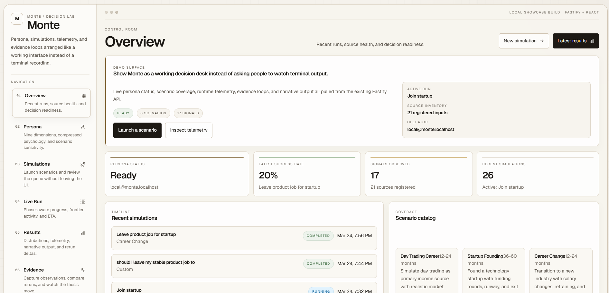

# Monte

> Give AI agents the judgment layer they need for hard real-life decisions.

Monte turns your personal data into a behavioral decision model that AI agents can consult before making high-stakes calls on your behalf. Instead of guessing what an average user might do, Monte helps an agent simulate how *you* are likely to think, hesitate, react under pressure, and trade off risk across hundreds of realistic futures.

For career moves, money choices, relocations, relationships, or any irreversible bet, Monte gives agents more than a one-shot answer: it returns outcome distributions, dominant uncertainties, recommended experiments, and evidence-adjusted reruns so decisions can improve as reality unfolds.

**Core loop:** Data -> Signals -> Persona -> Clones -> Simulation -> Evidence loop

## What Monte gives you

- A judgment engine AI agents can call before making expensive, emotional, or irreversible decisions
- Outcome distributions instead of a single yes/no answer
- A persona built from revealed behavioral signals, not just self-reported traits
- Decision intelligence with dominant uncertainties and recommended experiments
- Evidence capture plus reruns after the world gives you new information
- A deterministic benchmark harness for regression-testing the simulation layer

## Current product shape

Monte currently ships as:

- a Fastify API that can serve the bundled dashboard from the npm package
- a globally installable Commander CLI, including `monte start`
- a repo-local Vite + React dashboard in `apps/web` for local development and UI iteration
- BullMQ workers for ingestion, persona builds, and simulation batches
- Neo4j for graph persistence
- Redis for cache, live progress, and queue transport
- MinIO for uploaded source storage

In self-hosted OSS mode, auth is stubbed to a local injected user.

## Dashboard Preview

The repo-local dashboard gives Monte a fast five-minute product walkthrough instead of a terminal recording.



For more UI screens, see [docs/dashboard.md](docs/dashboard.md).

## Quickstart

### Requirements

- Node.js 20+
- Docker and Docker Compose
- A chat-capable OpenAI-compatible model key
- An embedding-capable key for persona builds

The simplest setup is `OPENROUTER_API_KEY`, which can cover both chat and embeddings.
For the globally installed CLI, you can either keep using environment variables or store provider credentials once with `monte config`.

### 1. Configure the environment

```bash
cp .env.example .env
```

Set at least:

- `NEO4J_PASSWORD`
- `OPENROUTER_API_KEY`, or equivalent chat plus embedding keys

Optional runtime tuning:

- `SIMULATION_BATCH_SIZE`
- `SIMULATION_DECISION_CONCURRENCY`
- `SIMULATION_ACTIVE_FRONTIER`
- `SIMULATION_CONCURRENCY` (legacy alias for decision concurrency)
- `SIMULATION_WORKER_CONCURRENCY`
- `SIMULATION_DECISION_BATCH_SIZE`
- `SIMULATION_DECISION_BATCH_FLUSH_MS`
- `LLM_RPM_LIMIT`

### 2. Start dependencies and install packages

```bash
docker compose up -d neo4j redis minio
npm install
```

Optional frontend env for the dashboard:

```bash
cp apps/web/.env.example apps/web/.env
```

### 3. Run the Monte API

```bash
npm run dev
```

The API starts on `http://localhost:3000` by default. Swagger docs are available at `http://localhost:3000/docs`.

### 4. Run the dashboard

```bash
npm run web:dev
```

The demo UI starts on `http://localhost:3001` by default and talks to the API on `http://localhost:3000` unless `VITE_MONTE_API_BASE_URL` is overridden.
This two-process flow is for repo-local development with live frontend edits.

### 5. Install the global CLI

```bash
npm install -g monte-engine
monte config set-api http://localhost:3000
monte config set-provider openrouter
monte config set-api-key <your-openrouter-key>
```

### 6. Verify the stack

```bash
monte doctor
monte doctor --json
monte config show
npm run web:build
```

## Global CLI Install

The primary published package is `monte-engine`, and the executable on your `PATH` is `monte`.

```bash
npm install -g monte-engine
monte config set-api http://localhost:3000
monte config set-provider openrouter
monte config set-api-key <your-openrouter-key>
monte doctor
```

If you use Groq for chat and a separate embedding provider, store both:

```bash
monte config set-provider groq
monte config set-api-key <your-groq-key>
monte config set-embedding-key <your-embedding-key>
```

CLI key storage lives in `~/.monte/config.json`. Environment variables still take precedence if both are set.

Monte also publishes a GitHub Packages mirror as `@elironb/monte-engine` so the package can be associated with this repository and show up in GitHub Packages. GitHub Packages is a secondary distribution path here, not the main install path, and it still requires npm auth against `https://npm.pkg.github.com`.

For local development inside this repo, use the source-running variant instead:

```bash
npm run cli:dev -- doctor
```

### Installed Dashboard And API

If Docker dependencies are already running and your current working directory contains the Monte `.env`, the globally installed package can start the API, workers, and bundled dashboard with one command:

```bash
monte start
```

Then open `http://localhost:3000`.

The bundled dashboard now includes a dedicated `Graph` tab for a clickable scenario DAG with live clone occupancy, edge flow, and sampled trace overlays alongside the existing overview, persona, live run, results, evidence, and sources surfaces.

Useful variants:

```bash
monte start --port 3001
monte start --no-dashboard
```

Repo contributors should still use `npm run dev` plus `npm run web:dev` when they want live backend and frontend reloads at the same time.

## Agent Integration

Monte is designed to be usable as a CLI step inside external agent systems like Claude Code, OpenClaw, or Hermes. The agent-facing entrypoint is `monte decide`.

Preflight:

```bash
monte config set-api http://localhost:3000
monte config set-provider openrouter
monte config set-api-key <your-openrouter-key>
monte doctor --json
```

One-shot decision:

```bash
monte decide "should I quit my job to start a company?" --mode standard --wait --json
```

Async flow:

```bash
monte decide "should I move to Berlin for this job?" --mode fast --json
monte simulate progress <simulation-id> --json
monte simulate results <simulation-id> -f json
```

`monte decide --json` returns a single JSON object. Without `--wait`, it returns the queued simulation plus recommended polling commands. With `--wait`, it also returns a condensed decision bundle and the raw aggregated results payload.

## Bundled Example Persona

Monte now ships a bundled starter persona inside the npm package so you can test the full loop without generating data first.

```bash
monte example list
monte example ingest starter
monte persona build
monte persona psychology
monte decide "should I leave my stable product job to join a startup and put $25k into the idea?" --mode fast --wait
```

If you want the raw filesystem path to the bundled dataset:

```bash
monte example path starter
```

## Quick Demo

Monte still ships a synthetic persona generator if you want a fresh persona tailored to a specific description.

```bash
monte generate "conservative 40 year old accountant, disciplined saver, risk-averse" -o ./persona-conservative
monte generate "25 year old crypto trader, YOLO mentality, high risk tolerance" -o ./persona-aggressive
```

Then ingest, build, and simulate each separately, or use `compare` for an A/B workflow.

## Progress Reporting

Simulation progress is phase-aware. Instead of appearing stuck at `95-99%`, Monte now surfaces the active phase:

- `queued`
- `executing`
- `persisting`
- `aggregating`
- `completed`
- `failed`

During execution, progress covers `0-90%`. Persistence covers `90-96%`. Aggregation uses stable end markers at `97-99%` so long-tail work is explained rather than looking frozen.

Monte also batches concurrent LLM decisions by decision node inside each worker batch. Instead of making one remote call per clone per node, Monte can group multiple clones waiting on the same fork into a single structured LLM request. This keeps decision quality LLM-backed while cutting request overhead and rate-limit pressure.

Under the hood, the scheduler is frontier-based rather than whole-clone-concurrency-based. Each worker batch keeps an active frontier of clones in memory, advances them locally until they block on a decision, groups those waiting decisions by node, and only then spends LLM concurrency.

If the provider starts rejecting large batched decision payloads, Monte now adapts by shrinking later batch sizes for that scenario/mode instead of repeating the same oversized request pattern all run long.

Example:

```bash
monte simulate "should I buy this house?" --wait
monte simulate progress <simulation-id> --json
```

## Runtime Telemetry

Completed simulations now include runtime telemetry in `simulate results -f json`, and the human-readable `simulate results` output shows a short runtime section. This includes:

- wall-clock duration
- execution, persistence, and aggregation timing
- decision concurrency and active frontier usage
- total LLM decision evaluations
- batched vs single LLM call counts
- batch retry, split, and leaf-fallback counts
- total rate-limiter wait time
- embedding time
- slowest decision nodes

Use this to understand whether a run is bottlenecked by chat latency, queueing, retries, or persistence instead of guessing.

## Benchmark Snapshot

Monte's benchmark harness is deterministic and seeded, so these numbers are a regression surface rather than a marketing screenshot. The current suite tracks:

- fixture pass rate
- calibration mean absolute error
- static policy regret
- uncertainty reduction after evidence
- deterministic stability drift

Current committed snapshot (`phase3-v2`):

- Fixtures: `3`
- Pass rate: `100%`
- Calibration MAE: `0.000`
- Policy regret: `0.232`
- Uncertainty reduction: `0.080`
- Max drift: `0.000`

You can regenerate the machine-readable snapshot with:

```bash
npm run benchmark -- --output examples/benchmarks/latest-benchmark.json
```

The latest benchmark snapshot is committed under `examples/benchmarks/`.

## Common CLI Workflows

### Persona workflow

```bash
monte ingest ./path/to/data
monte persona build
monte persona status
monte persona psychology
```

### Simulation workflow

```bash
monte simulate "should I quit my job and start a business?" --wait
monte simulate evidence <simulation-id> --recommendation 1 --result positive --signal "Customer interviews converted at 3x the prior rate"
monte simulate rerun <simulation-id> --wait
```

### Development workflow inside this repo

```bash
npm run cli:dev -- ingest ./path/to/data
npm run cli:dev -- persona build
npm run cli:dev -- decide "should I do this?" --mode standard --wait --json
```

## Built-in Scenario Types

Monte currently ships 8 scenario types including `custom`:

- `day_trading`
- `startup_founding`
- `career_change`
- `advanced_degree`
- `geographic_relocation`
- `real_estate_purchase`
- `health_fitness_goal`
- `custom`

## Benchmark Harness

The benchmark harness is a first-class regression surface for the simulation stack. It verifies:

- calibration error
- static policy regret
- uncertainty reduction after evidence
- deterministic stability drift

Commands:

```bash
npm run benchmark:pretty
npm run benchmark -- --output benchmark-suite.json
npm run test:benchmarks
```

Current fixture corpus:

- `startup_founding_seeded_corpus`
- `real_estate_purchase_carry_costs`
- `day_trading_edge_discipline`

## Publish To npm

The npm package name is currently `monte-engine`, while the installed executable is still `monte`.
GitHub Packages publishing is handled automatically by the release workflow as a mirror at `@elironb/monte-engine`, so the manual steps below are for npmjs.org only.

Release checklist:

```bash
npm login
npm whoami
npm run release:check
npm publish
```

If you eventually acquire the `monte` package name on npm, you can rename the package later without changing the CLI binary name.

## Project Map

- `src/index.ts` -> Fastify bootstrap and route registration
- `src/api/` -> HTTP routes and plugins
- `src/cli/` -> CLI bootstrap, config, and commands
- `src/ingestion/` -> ingestion, extractors, contradictions, queues
- `src/persona/` -> dimension mapping, graph build, compression, psychology, clone generation
- `src/simulation/` -> scenario compilation, engine, aggregation, evidence loop, progress helpers
- `src/benchmarks/` -> seeded benchmark harness
- `tests/` -> Vitest suites
- `docs/architecture.md` -> system architecture
- `CONTEXT.md` -> durable repo state
- `SKILL.md` -> repo-aware coding guidance
- `AGENTS.md` -> agent operating rules for this repository

## Development Notes

- Signal extraction is rule-based; do not route extraction through an LLM.
- Use the `openai` SDK for provider integrations.
- If simulation semantics change, rerun the benchmark harness.
- If architecture or commands change, keep `README.md`, `CONTEXT.md`, `AGENTS.md`, `docs/architecture.md`, and `SKILL.md` aligned.
- `connect` / Composio exists but is still experimental.
