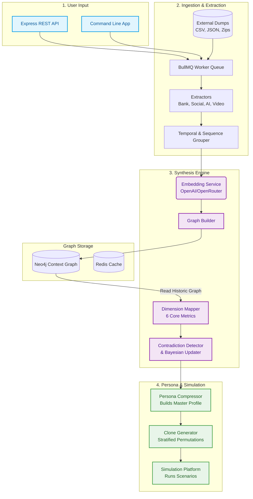

# Monte System Architecture

Monte is a psychological and behavioral persona generation engine. It ingests raw personal digital footprints (such as bank statements, YouTube histories, AI chats, and social media exports), maps them into structured behavioral vectors, and crystallizes them into a multi-dimensional psychological profile capable of simulated decision-making.

## 🏗 High-Level Technologies
- **Language**: TypeScript / Node.js
- **Primary Database**: **Neo4j** (Graph database for mapping complex relations between users, signals, traits, and contradictions)
- **Message Queue**: **Redis + BullMQ** (For async background ingestion of massive personal data exports)
- **AI/Embeddings**: **OpenAI / OpenRouter API** (For text embeddings, dimensionality mapping, and semantic similarity)

---

## 🧩 Core Components

### 1. The Entry Points (API / CLI) 
**Locations**: `src/api`, `src/cli`
Users can either run local CLI commands or use the Express REST API. 
The main interactions include initiating data **ingestion** jobs, viewing **persona details**, or running **simulations**.

### 2. Ingestion Pipeline & Extractors
**Locations**: `src/ingestion`, `src/ingestion/extractors`
When a user uploads a raw export (e.g., Plaid CSV, Netflix viewing history JSON, ChatGPT conversations), it goes to a BullMQ worker.
- **Extractors**: Specific parsers exist for each generic data type. Their job is to convert messy CSV/JSON into standardized `BehavioralSignal` objects.
- **Signals**: A signal is a discrete atom of behavior (e.g., "Purchased $50 at Starbucks", "Repeatedly asked an AI about existential dread at 3 AM"). 

### 3. Embeddings & Graph Building 
**Locations**: `src/embeddings`, `src/persona/graphBuilder.ts`
- Every extracted `BehavioralSignal` is converted into a vector embedding so the system can understand its semantic meaning.
- Signals are grouped by chronological sliding windows. Sequences (clusters of similar behavior over 72h) are grouped tightly.
- These representations are saved to Neo4j. The database tracks a hierarchy: `User -> DataSource -> Signal -> Trait`. 

### 4. Persona Generation & Dimension Mapping
**Locations**: `src/persona`
The core logic boundary of Monte. Here, thousands of disparate signals are compressed into a unified psychological model.
- **Dimension Mapper**: Projects the semantic distance of user signals onto 6 core psychological dimensions:
  1. Risk Tolerance
  2. Time Preference 
  3. Social Dependency
  4. Learning Style
  5. Decision Speed
  6. Emotional Volatility
  
- **Contradiction Detector**: Human behavior is messy. If someone buys high-risk penny stocks but writes paranoid notes about financial security, the `ContradictionDetector` catches the opposing signals, measures their temporal convergence, and decides if it is a passing phase or a permanent conflicting trait.
- **Bayesian Updaters & Decay**: Persona fingerprints aren't static. Old behaviors (a 5-year-old Netflix binge) decay via mathematical half-lives to hold less weight than recent data. Bayesian math safely updates the master persona incrementally as new data streams in.

### 5. Cloning & Simulation
**Locations**: `src/persona/cloneGenerator.ts`, `src/simulation`
You can't definitively predict a human's actions using a single static snapshot, so Monte generates **Clones**.
- **Clone Generator**: Using Monte Carlo techniques, the engine creates hundreds of cloned personas grouped into edge cases, outliers, and typical distributions. The permutations respect core psychological boundaries but inject statistical variance (e.g., testing what happens if the persona acts 15% more emotionally volatile today).
- **Simulation**: Clones can be fed into a "Decision Graph" featuring scenarios. The simulation engine determines how the persona clones would react to stimuli using the statistical boundaries mapped from their real-life digital footprints.

---

## 🗺️ Data Flow Diagram

