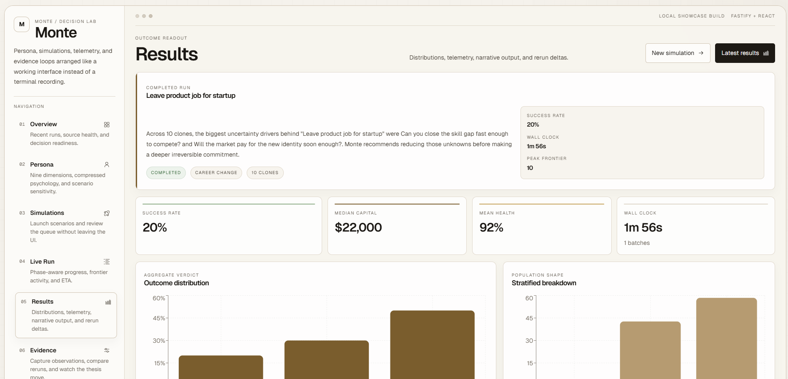
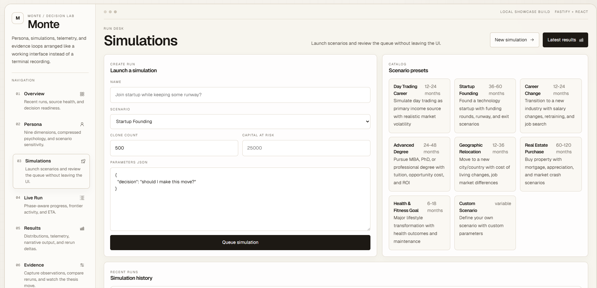

# Dashboard Gallery

Monte ships with a repo-local Vite + React dashboard in `apps/web` for showcasing the persona layer, simulation controls, live telemetry, and evidence loop without falling back to a CLI demo.

## Results

Outcome distributions, runtime telemetry, and rerun deltas live in the results surface.

## Simulations

The simulations tab lets you launch new runs and review the queue from the same interface.

